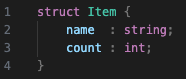
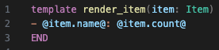
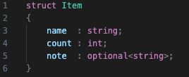
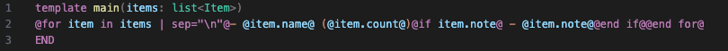

# tpp — Typed Template Compiler and Code Generator

tpp is a **typed template compiler** for structured text generation, code generation, and backend-neutral template execution. You define your data model once, write templates against that model, and let the compiler verify field access, optional handling, variant dispatch, and policy usage before any output is produced.

The important point is that tpp is not just a string templating syntax. It is a **compiler frontend plus multiple backends**:

- a compiler that produces a self-contained JSON intermediate representation
- a native C++ code generator that turns templates into typed functions
- Java and Swift code generation backends driven by the same IR
- a runtime renderer for scripting, tests, and dynamic execution
- a C++ library and language server for embedding and tooling

That makes tpp useful in two very different modes: as a **static codegen pipeline** for strongly typed builds, and as a **runtime template engine** with the same semantics and diagnostics.

---

## Core Concepts

### One Frontend, Multiple Backends

tpp separates concerns cleanly:

```
  .tpp type defs  ──┐
                    ├──▶ lib_tpp (C++ library) ──▶ tpp (compiler)  ──▶  compiler-output.json
  .tpp templates  ──┘                                                       │
                            │                                               ├──▶  tpp2cpp   → C++ types + functions
                            │                                               ├──▶  tpp2java  → Java source
                            │                                               ├──▶  tpp2swift → Swift source
                            │                                               └──▶  render-tpp → rendered output (scripting)
                            └──▶ tpp-lsp   → diagnostics, definitions, preview 
```

The `tpp` compiler frontend emits a **self-contained JSON document** that describes the compiled types, compiled template ASTs, and registered policies. Every backend consumes that document. Because the compiler has already done all the hard work — type checking, field validation, AST construction — each backend has an easy, focused job.

This is the architectural center of the project: language logic is implemented once, then reused everywhere. The C++ backend, Java backend, Swift backend, runtime renderer, and language tooling all benefit from the same validated representation.

### Typed Templates → Type-Safe C++ Functions

When you declare types and use them in templates, `tpp2cpp` can generate C++ code. Say, you have this project (declared in a file called `tpp-config.json`):

```json
{
    "templates": [
        "template.tpp"
    ],
    "types": [
        "types.tpp"
    ]
}
````

Now, define this struct



and this template:



Then

```bash
tpp . | tpp2cpp -functions > project_functions.h
```

generates

```cpp
// generated: project_functions.h
std::string render_item(const Item& item);
```

You call it with a real `Item` value. Pass the wrong type and your C++ compiler rejects it — at compile time, not at runtime.

That same compiled representation can also drive runtime rendering, source-mapped tooling, and non-C++ codegen. The template is written once, but it is not locked to a single consumption model.

### Why This Is Stronger Than Typical Template Engines

Most template engines stop at “render text from dynamic input”. tpp goes further:

- it gives templates a declared schema instead of untyped ad hoc values
- it rejects invalid field access before rendering starts
- it preserves a backend-neutral IR instead of baking logic into one target
- it can compile templates into real typed functions, not just interpret them
- it carries policies, source ranges, and structure into tooling and editors

That combination makes it much closer to a small language toolchain than a convenience templating library.

### Confidence Through Typing

The tpp compiler catches — *before any code runs* — every instance of:

- accessing a field that doesn't exist on a type
- reading an `optional<T>` field without first checking it's present
- forgetting to handle a variant case (with `checkExhaustive`)
- violating a declared content policy

See [What's the Point of Typing?](docs/language.md#whats-the-point-of-typing) for the full story.

## What You Get

- A typed schema language for structs, variants, lists, and optionals
- A template language with loops, conditionals, switches, comments, alignment, and policy-aware interpolation
- A compiler that emits self-contained JSON IR for downstream backends
- Code generation for C++, Java, and Swift from the same compiled templates
- A runtime renderer for shell use, tests, and embedded execution
- A C++ library for compiling, rendering, source mapping, and tooling integration
- A language server and VS Code extension for diagnostics and preview

---

## Configure and Build

[](https://github.com/AnarchoSystems/tpp/actions/workflows/ci.yml)

If you just want a working local build, configure once and build everything:

```bash
cmake -S . -B build
cmake --build build
```

What those two commands do:

- `cmake -S . -B build` configures the project, checks your compiler, generates the build system in `build/`, and writes a matching `.envrc`
- `cmake --build build` compiles all default targets, including the CLIs, the C++ library, the language server, and the test binaries

Requirements:

- a C++17-capable compiler
- CMake 3.20 or newer

After a full build, the main artifacts you will typically care about are:

- `tpp` — the compiler frontend
- `tpp2cpp` — the C++ code generation backend
- `tpp2java` — the Java code generation backend
- `tpp2swift` — the Swift code generation backend
- `render-tpp` — the direct rendering backend for scripts and tests
- `tpp-lsp` — the language server used by the VS Code extension
- `lib_tpp` — the C++ library for embedding the compiler and renderer

All executables are written to `build/bin/`, so tools like `direnv` only need to add a single directory to `PATH`.

The `.envrc` file is generated during configure and is intentionally not committed. After the first configure, run `direnv allow` once to approve it for this checkout.

If you are working in VS Code with the CMake Tools extension, the equivalent workflow is simply: configure the project once, then build the default target. That is the preferred developer workflow for this repository.

---

## Quick Start

This assumes you have already built the project. If not, use the configure/build steps above first.

**1. Define your types** (`types.tpp`):



**2. Write your template** (`template.tpp`):



**3. Configure the tpp project** (`tpp-config.json`):

```json
{
    "types": ["types.tpp"],
    "templates": ["template.tpp"]
}
```

**4. Compile and render**:

This step assumes that tpp and render-tpp are on your PATH, for example by using direnv.

```bash
tpp . | render-tpp main '[{"name": "Apples", "count": 4}, {"name": "Figs", "count": 1, "note": "fresh"}]'; echo
```

Output:
```
- Apples (4)
- Figs (1) — fresh
```

**5. Or generate C++**:

```bash
tpp . > project.json
tpp2cpp types     --input project.json > project_types.h
tpp2cpp functions --input project.json -i project_types.h > project_functions.h
tpp2cpp impl      --input project.json -i project_functions.h > project_implementation.cc
```

---

## Documentation

| Document | Contents |
|---|---|
| [Language Reference](docs/language.md) | The language itself: types, templates, expressions, loops, conditionals, switches, policies, alignment, escaping, and config |
| [Usage & Tooling](docs/usage.md) | The toolchain: compiler, IR flow, CLIs, generated-code backends, C++ runtime API, CMake integration, and VS Code support |

If you want the short version: read the README for the model, [docs/language.md](docs/language.md) for authoring templates, and [docs/usage.md](docs/usage.md) for the compiler/backends/tooling pipeline.

---

## Building The VS Code Extension

The `tpp-language-support` extension provides syntax highlighting, error diagnostics as you type, and a live preview panel.

It is not published on the VS Code Marketplace yet, so installation is currently manual.

### Build the Language Server

The extension depends on the `tpp-lsp` binary. The simplest path is to build the whole repository once:

```bash
cmake -S . -B build
cmake --build build
```

If you only want the language server target, this is enough:

```bash
cmake -S . -B build
cmake --build build --target tpp-lsp
```

With the current CMake layout, the binary is produced at:

```text
build/bin/tpp-lsp
```

### Build the Extension

The extension itself lives in `vscode-extension/` and requires Node.js:

```bash
cd vscode-extension
npm install
npm run compile
```

That produces the bundled extension entrypoint at `vscode-extension/out/extension.js`.

### Install the Extension

For a normal local install, package it as a `.vsix` and install that package into VS Code:

```bash
cd vscode-extension
npm run package
code --install-extension tpp-language-support-*.vsix
```

If you are developing the extension itself, you can also open `vscode-extension/` in VS Code and press `F5` to launch an Extension Development Host instead of installing a packaged build.

### Configure VS Code

By default, the extension looks for the language server at `build/bin/tpp-lsp`, which matches the repository's default local build layout.

If your `tpp-lsp` binary lives somewhere else, override `tpp.lspServerPath` in your VS Code settings:

```json
{
    "tpp.lspServerPath": "build/bin/tpp-lsp"
}
```

The setting accepts either an absolute path or a workspace-relative path.

See [Usage & Tooling → VS Code Extension](docs/usage.md#vs-code-extension) for full installation and configuration instructions.
