# tpp Language Reference

This page is the user-facing explanation of the language. For the authoritative agent/developer syntax reference used when editing `.tpp` and `.tpp.types` files, see `.github/instructions/tpp-language.instructions.md`.

tpp is a **typed template language designed to be compiled**, not just interpreted. You define the shape of your data once, write templates against that schema, and let the compiler verify field access, optional handling, variant dispatch, and policy usage before any output is produced.

That distinction matters. In tpp, templates are not throwaway text snippets hanging off dynamic values. They are checked program artifacts that can be rendered directly, converted into backend-neutral IR, and compiled into typed code for multiple target languages.

Templates use `@…@` delimiters for expressions and control flow. Everything outside those delimiters is literal text that passes through unchanged.

Two file roles exist in every tpp project:

| Role | File extension (convention) | Purpose |
|---|---|---|
| Type definitions | `.tpp` (declared as `"types"` in config) | Describe the data shapes that templates operate on |
| Template sources | `.tpp` (declared as `"templates"` in config) | Define the template functions that produce output |

Both roles use the same file extension; the [`tpp-config.json`](#tpp-configjson-reference) file is what separates them.

---

## What's the Point of Typing?

tpp templates are *typed*. Every parameter, every field access, every loop variable carries a declared type — and the compiler checks all of them before generating a single line of output.

That might sound like overhead, but it unlocks something much stronger than ordinary templating: **tpp templates can be compiled into type-safe functions and reused across multiple backends without reimplementing the language**.

### Templates become typed callable code

The `tpp2cpp` tool reads the compiler's output and emits C++ headers and implementations. Other backends consume the same IR for Java, Swift, runtime rendering, and tooling. A template like this:

```
template render_item(item: Item)
- @item.name@ (@item.count@)
END
```

becomes a genuine C++ function:

```cpp
// generated example
std::string render_item(const Item& item);
```

You call it with a real `Item` value. The compiler will reject any call that passes the wrong type. No JSON marshalling, no stringly-typed dispatch at the call site — the type system does the work.

This is the core payoff: the same template can participate in a scripting workflow, a native C++ build, or another backend pipeline, while preserving one set of semantics.

### Types travel with the output

Every generated C++ type carries a `tpp_typedefs()` static method that returns the original tpp source that produced it:

```cpp
std::string src = Item::tpp_typedefs(); // returns the raw .tpp type definition
```

This means a generated type is self-describing. You can reconstruct a `TppProject` and run it through the pipeline at runtime while still using the dynamic API alongside the static one.

### The dynamic API is still strongly typed

When you use the C++ library directly, you get a templated `get_function` that binds argument types at compile time:

```cpp
tpp::TppProject project;
project.add_type<Item>();
// ...add templates, run Lexer -> Parser -> SemanticAnalyzer -> Compiler...
tpp::IR output;

auto render = output.get_function<Item>("render_item");
std::string result = render(myItem); // type-checked: must pass an Item
```

If `render_item` expects an `Item` and you pass a `std::string`, your C++ compiler rejects the call.

### Confidence in output validity

Because the template compiler knows the schema of every value being interpolated, it can report — at *compile* time — every instance of:

- accessing a field that doesn't exist
- accessing an optional field without guarding it
- rendering a variant without handling all its cases (when `checkExhaustive` is set)
- violating a declared policy constraint

You get these diagnostics before any code runs, not when a user triggers an edge case in production.

> **Summary:** Typing in tpp is not a formality. It is what lets the project behave like a real language toolchain: templates can be validated once, lowered into a reusable IR, rendered dynamically, or compiled into statically typed code with the same rules.

---

## Type Definitions

Type definitions live in files declared as `"types"` in `tpp-config.json`. They introduce named data shapes that templates can reference.

### Structs

A struct is an ordered collection of named, typed fields:

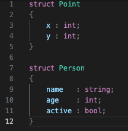

### Enums (Variants)

An enum is a tagged union. Each tag may optionally carry a payload:

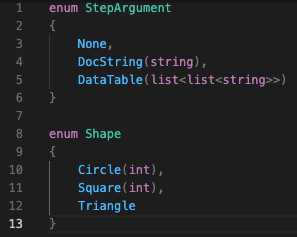

Tags with a payload use `TagName(Type)`. Bare tags have no payload.

### Primitive Types

| Type | Description |
|---|---|
| `string` | UTF-8 text |
| `int` | 64-bit integer |
| `bool` | Boolean (`true` / `false`) |

### Aggregate Types

| Type | Description |
|---|---|
| `list<T>` | Ordered sequence of values of type `T` |
| `optional<T>` | A value of type `T` that may be absent |

Nesting is allowed: `list<list<string>>`, `optional<list<int>>`, and so on.

### Optional Fields

Use `optional<T>` to declare a field that may be absent in the JSON input:

```
struct Article
{
    title   : string;
    summary : optional<string>;
}
```

Accessing an optional field in a template without guarding it is a **compile error**. See [Conditionals](#conditionals) for how to guard optional access correctly.

### Recursive Types

Types may reference themselves. To prevent infinite types, structs must break the recursion by making the recursive fields optional `optional<T>`:

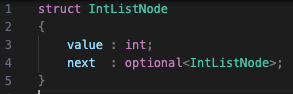

For enums, it suffices that a tag exists that does not recursively contain the enum type itself:


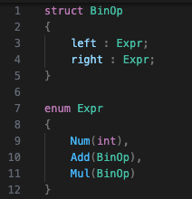

The compiler detects cycles automatically and marks the necessary fields as recursive. In generated C++ code, recursive fields become `std::unique_ptr<T>`.

### Documentation Comments

You can attach documentation to types and fields using `///` single-line doc comments or `/** */` block doc comments:

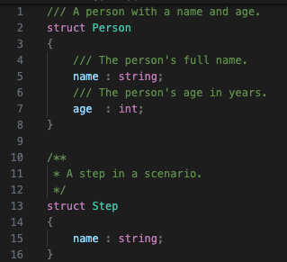

Doc comment text is preserved in the intermediate representation and attached to generated C++ types.

---

## Template Functions

Templates are defined with the `template` keyword and terminated with `END`:

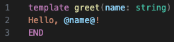

A template file may contain any number of `template` declarations. The entry point for rendering is conventionally named `main`, but any template can be called or rendered directly via the API.

### Multiple Parameters

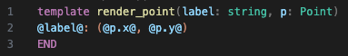

### Multiple Templates in One File

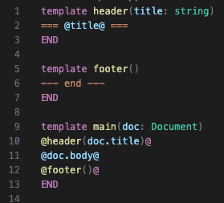

### Comments in Template Files

Outside of templates, template files support the same comment styles as type definition files:

```
// This is a line comment — ignored by the compiler.

/* This is a block comment.
   It can span multiple lines. */

/// This is a doc comment — attached to the next declaration.
template render_item(item: Item)
...
END
```

### Comment Blocks Inside Template Bodies

Use `@comment@` … `@end comment@` to suppress a block of text entirely. Everything between the markers is stripped from the rendered output:

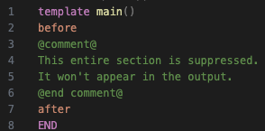

**Output:**
```
before
after
```

`@comment@` blocks can span multiple lines and may contain any text, including `@` characters.

---

## Expressions

A `@expr@` interpolation renders the value of a variable or field path at that position in the output:

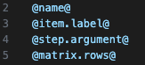

Field access uses `.`. Paths may be arbitrarily deep.

Expressions may also include a policy modifier — see [Policies](#policies).

---

## For Loops

Iterate over a `list<T>` field:

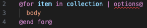

The body is rendered once per element. `item` names the loop variable; `collection` is a field path that must resolve to a `list<T>`.

### Options

All options are optional and appear after the `|`, space-separated:

| Option | Example | Effect |
|---|---|---|
| `sep="…"` | `sep=", "` | Text inserted *between* iterations (not after the last) |
| `precededBy="…"` | `precededBy="["` | Text prepended before the first item (only if the list is non-empty) |
| `followedBy="…"` | `followedBy="]"` | Text appended after the last item (only if the list is non-empty) |
| `enumerator=name` | `enumerator=idx` | Declares a 0-based integer loop counter named `name` |
| `align` | `align` | Pad columns to equal width (left-aligned by default) |
| `align="spec"` | `align="rl"` | Pad columns with per-column alignment spec (see below) |
| `policy="name"` | `policy="escape-html"` | Apply a named policy to all interpolations within this loop body |

**Example — separator and preceded/followed:**


Given `["a", "b", "c"]`, this produces `[a, b, c]`.

**Example — enumerator:**

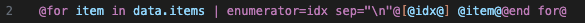

Produces:
```
[0] first
[1] second
[2] third
```

### Alignment

The `align` option turns your for loop body into a column-aligned table. Use `@&@` (the *alignment cell marker*) inside the body to separate columns:

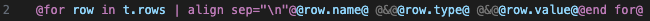

The compiler collects all rows, computes the maximum width of each column, and pads each cell accordingly. All columns are left-aligned by default.

**Example output:**
```
width   int    100
label   string hello
visible bool   true
```

#### Column Alignment Spec

Pass a string to `align` to control alignment per column: `l` (left), `r` (right), `c` (center):

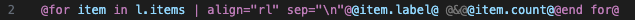

`"rl"` means: right-align column 1, left-align column 2. The spec length must equal the number of `@&@` separators plus one.

**Example output:**
```
 apples 5
    fig 42
bananas 3
```

Three-column example with `align="rll"`:

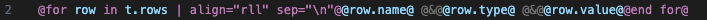

Output:
```
       x int    100
longname string true
```

### Nested Loops

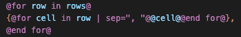

---

## Conditionals

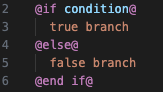

`@else@` is optional.

### Boolean Conditions

If `condition` resolves to a `bool` field, the true branch renders when the field is `true`:

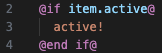

### Optional Guards

If `condition` resolves to an `optional<T>` field, the true branch renders when the field is *present*. Inside the true branch, the field is considered **guarded** and can be accessed without restriction:

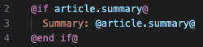

Accessing an optional field outside a guard is a **compile error**. The compiler tracks which optionals are known-present at every point in the template body.

### Negation

Prefix with `not` to invert the condition:

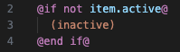

> **Compile-time guard rule:** Accessing an optional field in the `@else@` branch of `@if field@` — where the field is known *not* to be present — is also a compile error. The compiler enforces the guard in both directions.

---

## Switch / Case

Dispatch on an enum variant:

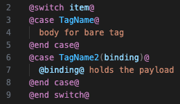

Unmatched tags produce no output by default.

### Exhaustive Check

Add `checkExhaustive` as a bare flag to require a `@case@` for every variant tag. The compiler reports an error if any tag is unhandled:

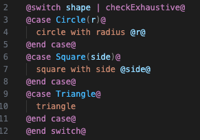

### Policy Scope on Switch

A policy modifier on `@switch@` applies to all interpolations within all case bodies:

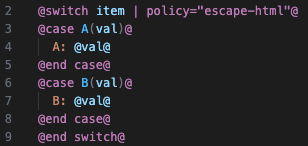

---

## Direct Function Calls

Call another template function inline by name:

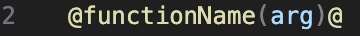

The result is inserted at that position. This is the primary mechanism for composition and recursion:

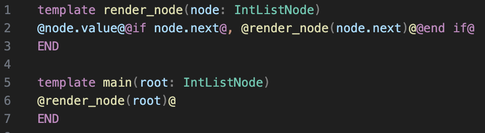

---

## Render Via

`render … via` dispatches to a named template for each element of a collection:

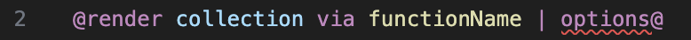

`functionName` is called once per element with that element as its argument. Options are the same as for `@for@` loops: `sep`, `precededBy`, `followedBy`, `enumerator`, `policy`.

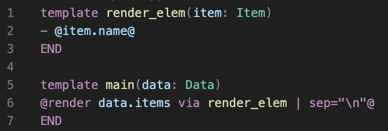

### Polymorphic Dispatch

When multiple overloads of `functionName` exist for different types, `render … via` selects the correct one at runtime based on the actual variant tag — enabling a clean visitor pattern:

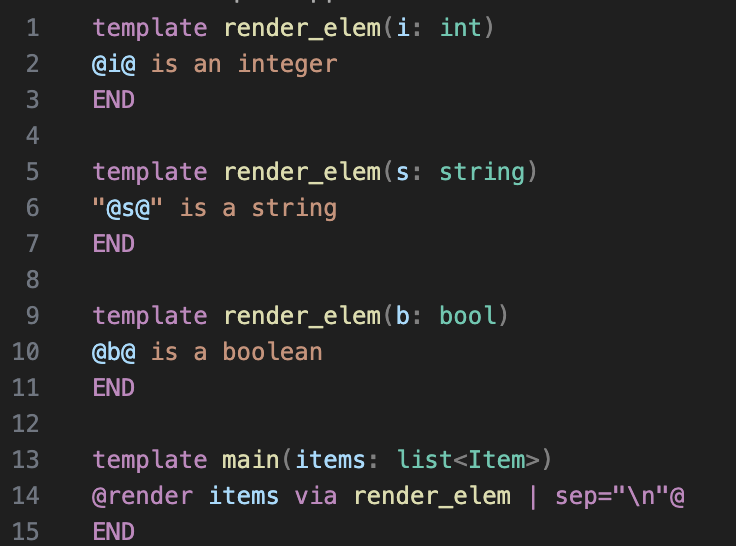

This works on individual enum instances as well:

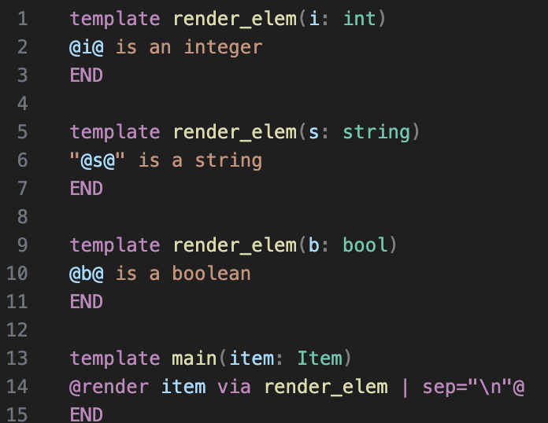

### Render Via on a Switch

`render … via` can also dispatch on a single case:

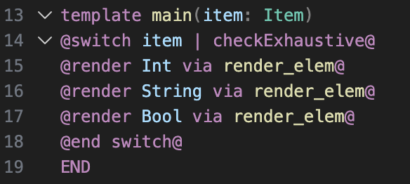

---

## Policies

A *policy* is a named, reusable set of validation and transformation rules that is applied to string values at render time. Policies let you enforce constraints (minimum length, rejected patterns, required format) and perform substitutions (escaping, filtering) without scattering that logic across every template.

### Declaring Policies

Policies are defined in separate JSON files and registered via `"replacement-policies"` in `tpp-config.json`:

```json
{
  "types": [],
  "templates": ["template.tpp"],
  "replacement-policies": ["escape-html.policy.json"]
}
```

A policy file has this structure:

```json
{
  "tag": "escape-html",
  "length": { "min": 1, "max": 1000 },
  "reject-if": { "regex": "<script", "message": "script tags are not allowed" },
  "require": [
    { "regex": "^[\\w\\s]+$" }
  ],
  "replacements": [
    { "find": "<", "replace": "&lt;" },
    { "find": ">", "replace": "&gt;" },
    { "find": "&", "replace": "&amp;" }
  ],
  "output-filter": [
    { "regex": "^[^<>]+$" }
  ]
}
```

All fields except `"tag"` are optional and can be combined freely.

#### Policy Fields

| Field | Type | Description |
|---|---|---|
| `tag` | string | Unique name used to reference this policy |
| `length` | object | Accepts `min` and/or `max` (character counts). Error if the value is too short or too long. |
| `reject-if` | object | `regex` (ECMAScript) + `message`. Error if the value matches the regex. |
| `require` | array | Ordered list of regex steps. Each step must match, or an error is raised. If the step has a `replace` string, the matched value is *transformed* by substitution — the replacement becomes the input for subsequent steps. |
| `replacements` | array | Ordered list of literal `find` / `replace` string pairs applied to the value in sequence. |
| `output-filter` | array | Applied after `replacements`. Each entry is a regex that the final output must match. Error if it doesn't. |

#### `require` Step Transformations

A `require` step with a `replace` string performs a regex substitution. Use `@subexpr_N@` in the `replace` string to reference capture group N:

```json
{
  "tag": "digits-only",
  "require": [
    { "regex": "^(\\d+)$", "replace": "number: @subexpr_1@" }
  ]
}
```

Input `"42"` → after the require step → `"number: 42"`.

### Applying Policies

Policies can be applied at four different scopes:

#### Per Variable

Apply to a single interpolation:

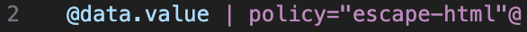

#### Per Template

Declare on a template: the policy applies in the entire template:

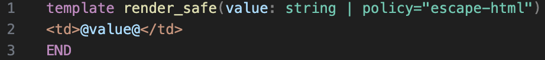

Even templates called *from within that template body* inherit that policy.

#### Per For Loop

Apply to all interpolations within a loop body, including through function calls made within the loop:

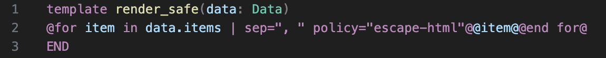

#### Per Render Via

Apply to all interpolations in the dispatched template:

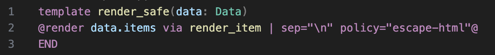

#### Per Switch

Apply to all interpolations in all case bodies:

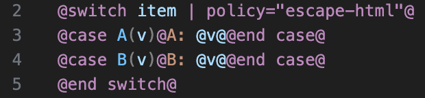

### Policy Scope Propagation

Policies propagate *through* function calls. If a for loop declares `policy="escape-html"`, that policy is active when any template function is called from within the loop body — even if that function doesn't declare the policy itself:

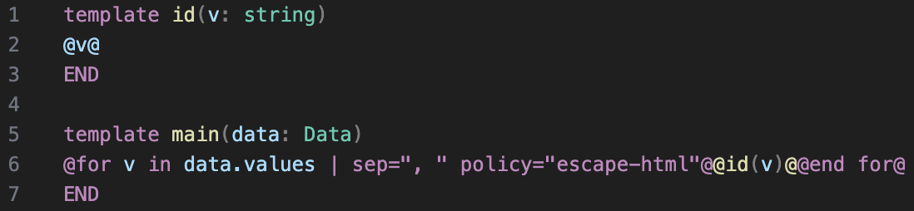

The `escape-html` policy applies to `@v@` inside `id`, because it was inherited from the enclosing for loop scope.

### Overriding an Inherited Policy

Policies from outer scopes are overridden if you set one in an inner scope.

To opt out of an inherited policy at a specific interpolation, use `policy="none"`:

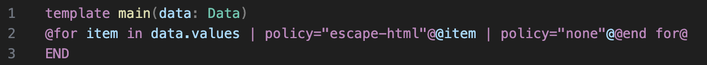

`policy="none"` explicitly removes the enclosing scope's policy for that expression.

### Policy Errors

Policies produce **render-time errors** — the template renders successfully up to the point where the violated value is encountered, then raises an error with the tag name and reason.

---

## Block vs Inline Lines

The distinction between block lines and inline lines governs how whitespace is handled around control-flow directives.

### Block Lines

A line that contains *only* structural directives and optional whitespace is a **block line**. It is consumed without emitting any output or newline. The following are block lines:

```
@for item in list@
@if active@
@end for@
@end if@
@case A(v)@
```

### Inline Lines

A line that mixes literal text or expressions with directives is an **inline line**. It is emitted as-is, including any surrounding text:

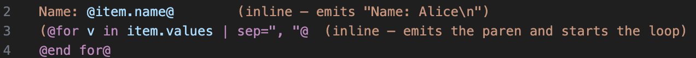

### Block Indentation

When a block body is rendered, the **zero marker** — the leading whitespace of the first non-empty line in the body — is stripped from every body line. The body is then re-indented to the insertion column of the enclosing directive:

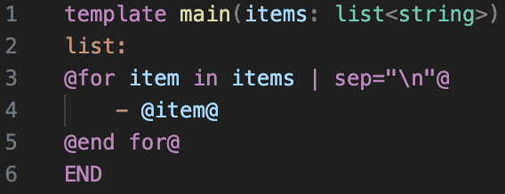

produces for example

```
list:
- foo
- bar
```

but 

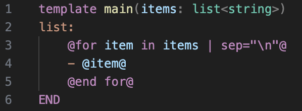

produces


```
list:
    - foo
    - bar
```

---

## Escaping

To produce a literal `@` character in output, write `\@`:

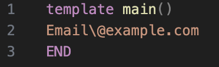

Output: `Email@example.com`

Similarly, `\END`becomes `END`.

### Adjacent Directives

Adjacent directives like `@v@@end for@` work naturally. The tokenizer operates in two modes — **text mode** and **directive mode** — and the closing `@` of one directive always returns to text mode. The very next `@` opens the following directive. No special syntax is needed.

> **Error:** Two `@` signs with *literally nothing between them* (`@@` in a position where a directive would be opened) is a parse error: "empty directive". This only occurs when the parser is in text mode and encounters `@@`. Inside a running directive, `@` terminates it normally.

---

## tpp-config.json Reference

Every tpp project has a `tpp-config.json` file that tells the compiler which files play which role.

### Full Schema

```json
{
  "types": ["typedefs.tpp", "types/*.tpp"],
  "templates": ["templates/*.tpp"],
  "replacement-policies": ["policies/escape-html.json"],
  "previews": [
    {
      "name": "Default preview",
      "template": "main",
      "input": { "name": "World" }
    },
    {
      "name": "From file",
      "template": "main",
      "input": "samples/input.json"
    }
  ]
}
```

### Keys

| Key | Type | Description |
|---|---|---|
| `types` | `string[]` | Glob patterns (relative to config) for type-definition files. Processed in order. |
| `templates` | `string[]` | Glob patterns (relative to config) for template source files. Processed in order after types. |
| `replacement-policies` | `string[]` | Relative paths to policy JSON files. Loaded before compilation. |
| `previews` | `object[]` | Preview configurations used by the VS Code extension's live preview panel. |

### Glob Patterns

Patterns support `*` wildcards. All matched paths are sorted alphabetically before processing:

```json
"types": ["shared/base.tpp", "types/*.tpp"]
```

`shared/base.tpp` is processed first (literal path), then all `*.tpp` files in `types/` in sorted order.

### Previews

Each preview entry declares a template to render and the input data to use in the live preview panel:

| Field | Required | Description |
|---|---|---|
| `name` | No | Display name shown in the preview panel |
| `template` | Yes | Name of the template function to render |
| `input` | No | Inline JSON value (object or array) **or** a relative path to a `.json` file |
